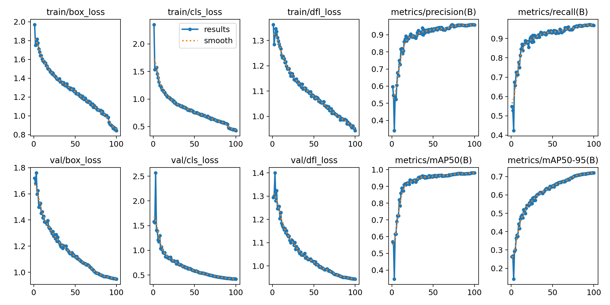
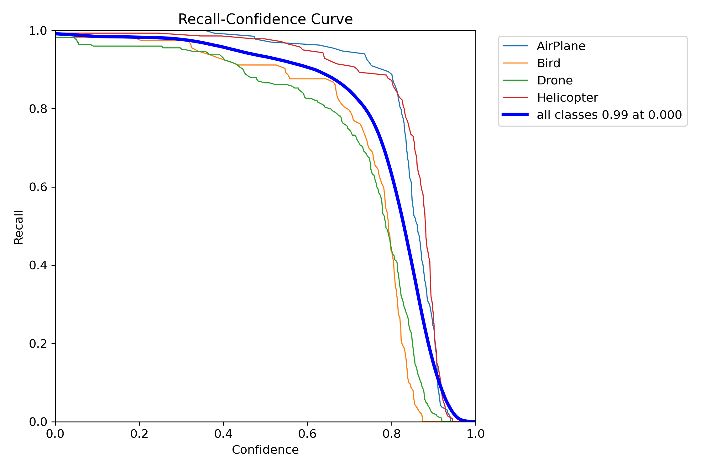
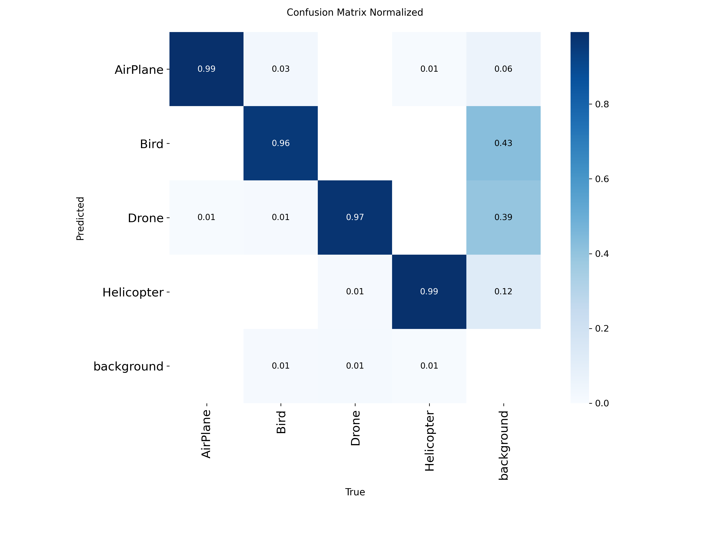

# Multi-Layer Anti-Drone Defense System

**A real-time, sensor-fused counter-UAS platform combining dual-model computer vision (RGB + thermal YOLOv8), Kalman/IoU-based multi-object tracking, PID visual servoing, and a novel NMSE threat-prioritization engine — running on a laptop and Arduino, no Raspberry Pi required.**

The system detects, classifies, tracks, and prioritizes aerial threats (drones vs. birds/planes/helicopters) in real time by fusing RGB and thermal camera feeds, then drives a pan-tilt gimbal and radar sweep via Arduino to engage the highest-priority target — with an optional reinforcement-learning layer that adaptively tunes the tracking controller online.

---

## Table of Contents

- [Overview](#overview)
- [Key Features](#key-features)
- [System Architecture](#system-architecture)
- [Project Structure](#project-structure)
- [How It Works](#how-it-works)
  - [1. Dual-Sensor Detection](#1-dual-sensor-detection)
  - [2. Sensor Fusion](#2-sensor-fusion)
  - [3. NMSE Threat Prioritization](#3-nmse-threat-prioritization)
  - [4. PID Visual Servoing + RL Gain Tuning](#4-pid-visual-servoing--rl-gain-tuning)
- [System-Concept-Demonstration](#System-Concept-Demonstration)
- [Model Performance](#model-performance)
- [Getting Started](#getting-started)
- [Hardware Setup](#hardware-setup)
- [Roadmap](#roadmap)
  
---

## Overview

This project replaces a Raspberry Pi–based architecture with a **laptop-as-compute / Arduino-as-actuator** split:

| Component | Role |
|---|---|
| **Laptop** | Runs dual YOLOv8 inference (RGB + thermal), sensor fusion, multi-object tracking, NMSE priority scoring, and PID control loop |
| **Arduino** | Handles low-level actuation only — pan-tilt servos, ultrasonic radar sweep, jammer relay, laser designator |

Both the RGB and thermal camera feeds are processed **every frame, simultaneously** — there is no day/night mode switch. Detections are geometrically aligned and fused for higher-confidence, more robust threat detection than either sensor alone.

## Key Features

- **Dual-model detection** — 4-class RGB YOLOv8 (Bird, Drone, Airplane, Helicopter) + 2-class thermal YOLOv8, running concurrently
- **Calibrated sensor fusion** — similarity-transform alignment (rotation + scale + translation) between thermal and RGB, with IoU-based box matching and confidence boosting on cross-sensor agreement
- **Multi-object tracking** — persistent track IDs via a centroid/IoU tracker (swappable for DeepSORT)
- **NMSE priority queue** — a genuine normalized mean-squared-error scoring function ranks all live tracks by distance, closing speed, confidence, and size to decide *who gets engaged first*
- **Full PID visual servoing** — proportional-integral-derivative gimbal control with anti-windup clamping, replacing a pure-proportional controller
- **Optional RL gain auto-tuner** — a lightweight tabular Q-learning agent adaptively nudges PID gains at runtime, with engagement decisions kept fully deterministic and auditable
- **Radar + camera fusion** — ultrasonic (swappable for mmWave IWR1843) distance sweep independent of the camera gimbal
- **Live dual-feed view** — thermal picture-in-picture overlay on the RGB stream
- **CSV event logging** for post-run analysis

## System Architecture

```
┌─────────────┐     ┌─────────────┐
│  RGB Camera │     │Thermal Camera│
└──────┬──────┘     └──────┬──────┘
       │                   │
       ▼                   ▼
  YOLOv8 (4-cls)      YOLOv8 (2-cls → "Drone")
       │                   │
       └─────────┬─────────┘
                  ▼
          Sensor Fusion (IoU + calibrated transform)
                  ▼
          Multi-Object Tracker
                  ▼
        NMSE Priority Queue (Layer 4)
                  ▼
      PID Visual Servoing (+ optional RL tuner)
                  ▼
     Serial Link → Arduino (gimbal / radar / jammer / laser)
```

## Project Structure


```
anti_drone_system/
├── firmware/
│   └── anti_drone_controller/anti_drone_controller.ino   # flash to Arduino
├── anti_drone_pipeline/
│   ├── config.py               # all tunable constants
│   ├── serial_link.py          # threaded serial comms w/ Arduino
│   ├── detection_source.py     # RGB + thermal YOLO inference
│   ├── fusion.py                # sensor fusion (Layer 2/3)
│   ├── tracker.py              # multi-object tracking
│   ├── priority.py             # NMSE priority scoring (Layer 4)
│   ├── pantilt_controller.py   # PID visual servoing
│   ├── rl_tuner.py             # Q-learning adaptive PID tuning (optional)
│   ├── logger.py               # CSV event log
│   └── main.py                 # state machine / entry point
├── models/                     # trained .pt weights go here
├── tools/
│   └── calibrate_thermal_offset.py
├── logs/                       # CSV logs land here at runtime
└── requirements.txt
```

## How It Works

### 1. Dual-Sensor Detection
Both cameras and both models run **every frame** — there's no brightness-based day/night switch. The RGB model detects 4 classes (only `Drone` counts as a threat; the rest are still shown for context). The thermal model's 2 classes are collapsed into a single canonical `"Drone"` label, with class-agnostic NMS to prevent duplicate tracks from overlapping thermal boxes.

### 2. Sensor Fusion
Thermal detections are projected into RGB pixel space using a calibrated similarity transform (`cv2.estimateAffinePartial2D`), computed once via `tools/calibrate_thermal_offset.py`. Matched RGB/thermal pairs are merged with weighted box averaging and a confidence boost for cross-sensor agreement; unmatched detections from either sensor are still forwarded so a low-heat-contrast or glare-blinded target isn't silently dropped.

### 3. NMSE Threat Prioritization
Every live track is scored on 4 normalized features — distance to protected zone, closing speed, fused confidence, and bounding-box size — using a genuine normalized mean-squared-error function against the ideal "maximum threat" vector:

```
score = 1 − Σ wᵢ · (1 − fᵢ)²
```

The resulting max-priority heap answers, every frame, *"which target should be engaged right now?"*

### 4. PID Visual Servoing + RL Gain Tuning
The gimbal controller uses full PID per axis (P for current error, I for persistent drift, D for overshoot damping, with anti-windup clamping). An optional tabular Q-learning agent can adaptively scale the proportional gain based on recent tracking error trends — it only affects *how aggressively* the gimbal chases the already-selected target, never *which* target is chosen, keeping engagement logic deterministic and auditable.

## System Concept Demonstration

https://github.com/user-attachments/assets/fdaeaf48-755c-4317-a3a3-448422952287

## Model Performance

RGB 4-class YOLOv8s detector — trained for 100 epochs:

<p align="center">
  
</p>

| Metric | Value |
|---|---|
| Precision (B) | ~0.96 |
| Recall (B) | ~0.97 |
| mAP50 (B) | ~0.98 |
| mAP50-95 (B) | ~0.73 |

**Recall–Confidence curve** (all classes 0.99 recall at confidence 0.000):

<p align="center">
  
</p>

**Normalized confusion matrix:**

<p align="center">
  
</p>

> The thermal detector uses a separate 2-class YOLOv8 model trained on a dedicated thermal drone dataset (its own metrics live in `models/`).

## Getting Started

### 1. Install dependencies
```bash
pip install -r requirements.txt
```

### 2. Add model weights
Drop your trained weights into `models/`:
```
models/rgb_multiclass_yolov8s_best.pt
models/thermal_yolov8_best.pt
```

### 3. Configure
Set camera indices, serial port, and all tunables in `anti_drone_pipeline/config.py`.

### 4. Calibrate thermal-RGB alignment
```bash
python -m tools.calibrate_thermal_offset
```

### 5. Run
```bash
python -m anti_drone_pipeline.main
```
Press `q` to quit — the `finally` block safely disables the laser/jammer and restores the radar sweep, so let it shut down gracefully rather than force-killing the process.

## Hardware Setup

- **Radar sweep servo** — carries the ultrasonic (or future mmWave IWR1843) sensor
- **Pan-tilt gimbal (2 servos)** — carries the RGB + thermal cameras rigidly mounted together
- Flash `firmware/anti_drone_controller/anti_drone_controller.ino` via the Arduino IDE (`Servo.h`, built-in library only)
- Full pin mapping is defined at the top of the `.ino` file

## Roadmap

- [ ] Swap `DeepSortTracker` in for appearance-based re-ID in swarm scenarios
- [ ] Replace ultrasonic sensor with mmWave IWR1843 (only `readDistanceCm()` needs to change)
- [ ] Empirically tune `PRIORITY_WEIGHTS`, PID gains, and fusion weights
- [ ] Extended RL gain-tuner sessions before live demos
- [ ] Confirm thermal dataset class alignment (2-class `data.yaml`)
